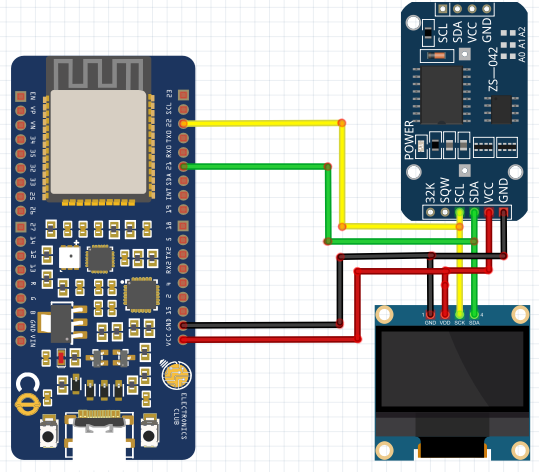

# Real time Clock using DS3231 module and OLED in ESP32
In this tutorial, we will learn about the Real Time Clock (RTC) and its interfacing with the ESP32 and OLED display. We will use DS3231 RTC module to keep track of the correct time and display it on SPI OLED by using ESP32 as our microcontroller.

## What is Real Time Clock??
DS3231 is a RTC (Real Time Clock) module. It is used to maintain the date and time for most of the Electronics projects. This module has its own coin cell power supply using which it maintains the date and time even when the main power is removed or the MCU has gone through a hard reset. So once we set the date and time in this module it will keep track of it always. In general most of the other clock modules avaiable in the market, we need to reset the tme every time we off an d on it. There are several types of RTC ICs available like DS1307, DS3231 etc.


## What is OLED Display module?
At the heart of the module is a powerful single-chip CMOS OLED driver controller – SSD1306. It can communicate with the microcontroller in multiple ways including I2C and SPI. SPI is generally faster than I2C but requires more I/O pins. While I2C requires only two pins and can be shared with other I2C peripherals. It’s a trade-off between pins and speed. So, it really boils down to your choice. There are lot of Libraries available for interfacing it with different Microcontrollers, using which we can make the interfacing a lot simpler. These libraries are easy to use and have lot of readily available graphical options. Also there are many online tools available for converting an image into a bit map values to be fed into microcontrollers.

The description of the individual pins of the OLED Module is shown below:


## Materials Required
- ESP32 (Microcontroller)
- DS3231 RTC module (The Real time clock)
- 7 pin 128×64 OLED display Module (SSD1306) (OLED Module)
- Male-female wires 
- Breadboard

## Circuit Diagram


RTC DS3231 IC uses I2C mode of communication. It has SCL, SDA, Vcc and GND pins coming out of it. The Connection of RTC module with ESP32 is given below:

1. SCL of RTC -> SCL of ESP32 i.e. Pin D22
2. SDA of RTC -> SDA of ESP32 i.e. Pin D21
3. GND of RTC -> GND of ESP32
4. Vcc of RTC -> Vcc of ESP32

Here, we are using SPI mode to connect our 128×64 OLED display Module (SSD1306) to ESP32. So, it will use 7 pins. Connections with ESP32 are given as:

1. SDA pin of OLED -> PIN 21 of ESP32
2. SCK pin of OLED -> PIN 22 of ESP32
3. Vdd of OLED -> Vcc of ESP32
4. GND of OLED -> GND of ESP32

## Libraries Used
1. Adafruit_SSD1306 : https://github.com/adafruit/Adafruit_SSD1306
2. Adafruit_GFX : https://github.com/adafruit/Adafruit-GFX-Library
3. RTClib : https://github.com/adafruit/RTClib

## Code
```
// Imprting the Required Libraries
#include <SPI.h>
#include <Wire.h>
#include <Adafruit_GFX.h>
#include <Adafruit_SSD1306.h>
#include "RTClib.h"

// Instanciating a RTC Module
RTC_DS3231 rtc;
char daysOfTheWeek[7][12] = {"Sunday", "Monday", "Tuesday", "Wednesday", "Thursday", "Friday", "Saturday"};

// Setting up the OLED Screen
#define SCREEN_WIDTH 128  // OLED display width, in pixels
#define SCREEN_HEIGHT 64  // OLED display height, in pixels
#define OLED_RESET    -1  // Reset pin # (or -1 if sharing reset pin)
Adafruit_SSD1306 display(SCREEN_WIDTH, SCREEN_HEIGHT, &Wire, OLED_RESET);
 
 
void setup() 
{
 
Serial.begin(9600);

// Searching for the RTC module
if (! rtc.begin()) {
Serial.println("Couldn't find RTC");
while (1);
}

// Establishing connection with OLED
if(!display.begin(SSD1306_SWITCHCAPVCC, 0x3C)) 
{ 
    Serial.println(F("SSD1306 allocation failed"));
    for(;;); // Don't proceed, loop forever
}

// Finding the Date and time
rtc.adjust(DateTime(__DATE__, __TIME__));
 
 display.display();
 delay(2);
 display.clearDisplay();
 
 
display.clearDisplay();
display.setTextColor(WHITE);
//display.startscrollright(0x00, 0x0F);
display.setTextSize(2);
display.setCursor(0,5);
display.print("  Clock ");
display.display();
delay(3000);
}
 
void loop()
{
DateTime now = rtc.now(); // Getting the instantaneous time

// Displaying the seconds
display.clearDisplay();
display.setTextSize(2);
display.setCursor(75,0);
display.println(now.second(), DEC); 
 
display.setTextSize(2);
display.setCursor(25,0);
display.println(":");
 
display.setTextSize(2);
display.setCursor(65,0);
display.println(":");

// Displaying the minutes
display.setTextSize(2);
display.setCursor(40,0);
display.println(now.minute(), DEC);

// Displaying the hour
display.setTextSize(2);
display.setCursor(0,0);
display.println(now.hour(), DEC);

// Displaying the day
display.setTextSize(2);
display.setCursor(0,20);
display.println(now.day(), DEC);
 
display.setTextSize(2);
display.setCursor(25,20);
display.println("-");

// Displaying the month
display.setTextSize(2);
display.setCursor(40,20);
display.println(now.month(), DEC);
 
display.setTextSize(2);
display.setCursor(55,20);
display.println("-");

// Displaying the year
display.setTextSize(2);
display.setCursor(70,20);
display.println(now.year(), DEC);

// Displaying the day of the week
display.setTextSize(2);
display.setCursor(0,40);
display.print(daysOfTheWeek[now.dayOfTheWeek()]);
 
display.display(); 
}
```

## Future Projects
Once you have suceesfully completed this tutorial and understood the working of the real time clock, as a follow up to this you could work on the ***ESP32 world Clock***, wherein you provide a menu in the OLED to the user to choose a region in the world from the list and display the real time in that location. As an bonus, you could also adding the world map on the OLED screen.
## References

You can find more details of the project and the description of the components [here](https://circuitdigest.com/microcontroller-projects/esp32-real-time-clock-using-ds3231-module)
