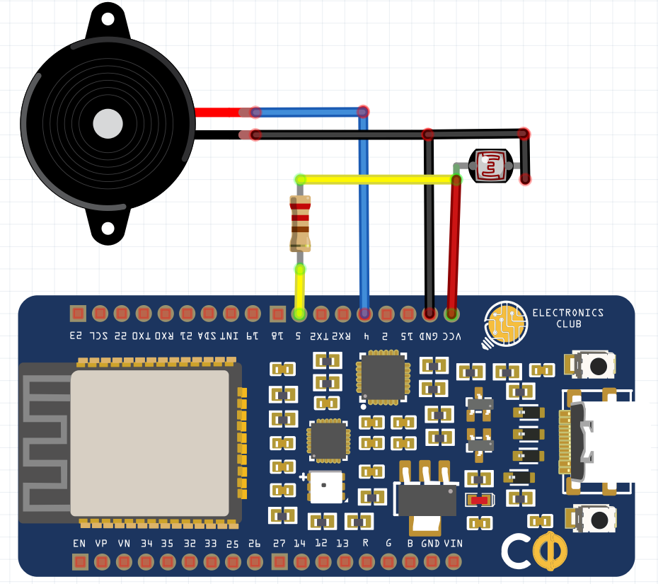

# ESP32 deep sleep tutorial
## Description
We'll see how we can put the custom board in deep sleep mode to conserve power and make projects battery friendly.       
## Concept
Inside the chip, we can find the two processing cores, the RAM and ROM memory, the WiFi module, the Bluetooth Module, a hardware acceleration module for cryptographic applications, the RTC module, and a lot of peripherals. Inside the RTC module, we can find a PMU (Phasor measurement unit) a small and very low power 32-bit co-processor, and 8Kbs of RAM memory. This small amount of memory is very useful as you are going to find out in a moment. 


The WiFi modules, the Processing Cores, and the Bluetooth module require a lot of current to operate. So, if we want to conserve power we have to disable them when don’t use them. We put the ESP32 to deep sleep mode, where it disables everything except the RTC module. There is a light sleep mode and the Deep sleep mode. In Deep Sleep mode the chip offers the lowest power consumption. It just needs 0.01 mAs of current in Deep Sleep mode and that’s the purpose of the tutorial.
## Prerequisites
Arduino IDE
## Components
* Electronics Club Custom Development Board (CDB)          
* LED
* Resistor - 10k
* Jumpers
* Breadboard   
## Schematic
Buzzer Pin 1 --> 4 of CDB             
Buzzer Pin 2 --> GND                    
LDR Leg 1 --> 10k Resistor --> 5 of CDB              
LDR Leg 1 --> VCC           
LDR Leg 2 --> GND               
###### (Note: Leg 1 and Leg 2 are named arbitrarily)

## Code
```c
#define uS_TO_S_FACTOR 1000000  /* Conversion factor for micro seconds to seconds */
#define TIME_TO_SLEEP  3        /* Time the board will go to sleep (in seconds) */

RTC_DATA_ATTR int bootCount = 0;

int GREEN_LED_PIN = 25;
int YELLOW_LED_PIN = 26;

void setup(){

  pinMode(GREEN_LED_PIN,OUTPUT);
  pinMode(YELLOW_LED_PIN,OUTPUT);
  delay(500);
  
  if(bootCount == 0) //Run this only the first time
  {
      digitalWrite(YELLOW_LED_PIN,HIGH);
      bootCount = bootCount+1;
  }else
  {
      digitalWrite(GREEN_LED_PIN,HIGH);
  }
  
  delay(3000);

  digitalWrite(GREEN_LED_PIN,LOW);
  digitalWrite(YELLOW_LED_PIN,LOW);

  esp_sleep_enable_timer_wakeup(TIME_TO_SLEEP * uS_TO_S_FACTOR);
  esp_deep_sleep_start();
}

void loop(){
  
}
```
## Follow-up Problem Statement
Can you use the capacitive touch pins and Aluminium foil to change the frequency of the buzzer as you slide your finger over the foil??
## References
[ESP32 deep sleep tutorial](https://www.instructables.com/ESP32-Deep-Sleep-Tutorial/)
