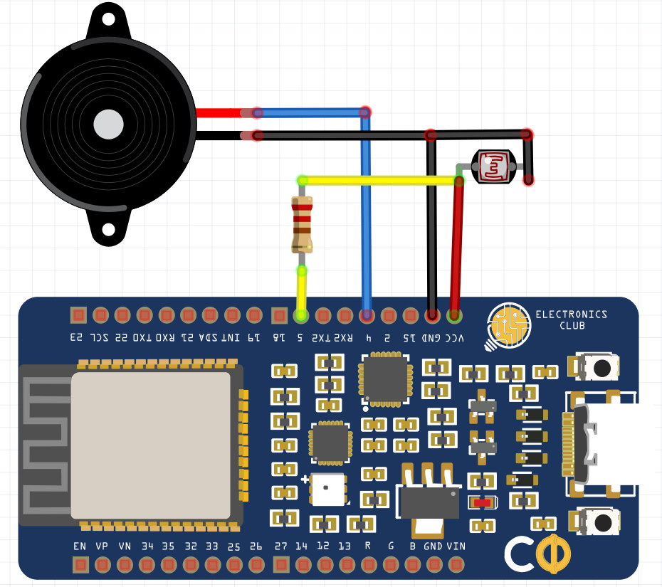

# Theremin using Light-Dependent Resistor
## Description
You might have seen Sheldon playing the Theremin on The Big Bang Theory or heard it on Star Trek. In this project, you will be building a simple Theremin-like setup using a Light-Dependent Resistor and Buzzer       
##### Difficulty Level 
Easy
## Concept
We will duplicate a similar sound as that of a Theremin, digitally using a buzzer controlled by Pulse Width Modulations and a Light Dependent Resistor (LDR), for reading the hand movements over it which will be considered as inputs to control the sound coming out of the buzzer.
## Prerequisites
Arduino IDE
## Components
* Electronics Club Custom Development Board (CDB)          
* Light-Dependent Resistor (LDR)             
* Buzzer
* Resistor - 10k
* Jumpers
* Breadboard   
## Schematic
Buzzer Pin 1 --> 4 of CDB             
Buzzer Pin 2 --> GND                    
LDR Leg 1 --> 10k Resistor --> 5 of CDB              
LDR Leg 1 --> VCC           
LDR Leg 2 --> GND               
###### (Note: Leg 1 and Leg 2 are named arbitrarily)

## Code
```
int photopin = 5; // Pin where the photo resistor is connected to
int photValue; // The analog reading from the photoresistor
int buzzerPin = 4; // Connect Buzzer to Pin 4
long buzzerFreq; // The frequency to buzz the buzzer
// You can experiment with these values:
long buzzMAX = 2500; // Maximum frequency for the buzzer
long photoMAX = 1023; // Maximum value for the photoresistor
void setup() {
    pinMode(buzzerPin, OUTPUT); // set a pin for buzzer output
}
void loop() {
    // read the values of the photoresistor
    photValue = analogRead(photopin); // Values 0-1023
    // normalize the readings of a photoresistor to that of the buzzer and photoresistor
    buzzerFreq = (photValue * buzzMAX) / photoMAX;
    buzz(buzzerPin, buzzerFreq, 10);
}
void buzz(int targetPin, long frequency, long length) {
    long delayValue = 1000000/frequency/2;
    long numCycles = frequency * length/ 1000;
    for (long i=0; i < numCycles; i++){
        digitalWrite(targetPin,HIGH);
        delayMicroseconds(delayValue);
        digitalWrite(targetPin,LOW);
        delayMicroseconds(delayValue);
    }
}
```
## Follow-up Problem Statement
Can you use the capacitive touch pins and Aluminium foil to change the frequency of the buzzer as you slide your finger over the foil??
## References
[Simple Theremin with ESP32](https://www.instructables.com/Make-a-Pocket-Size-Theremin-With-ESP32/)
