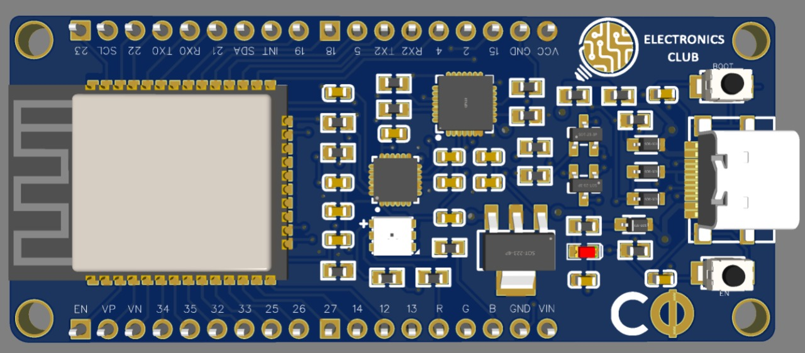
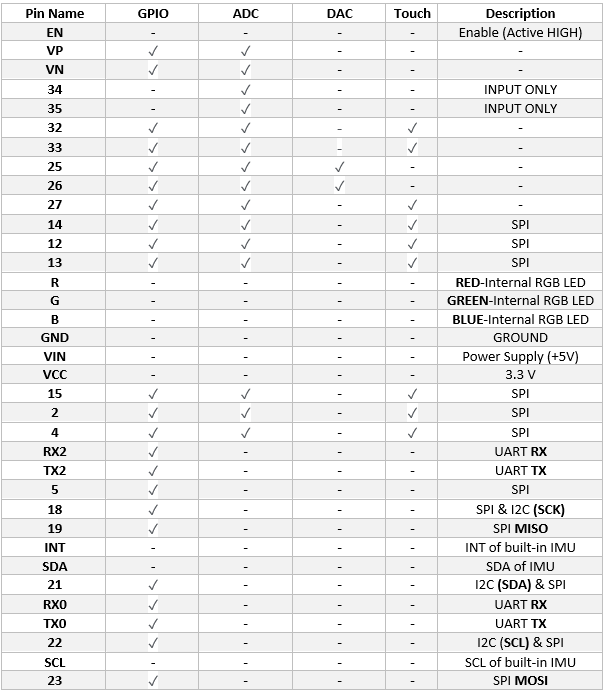
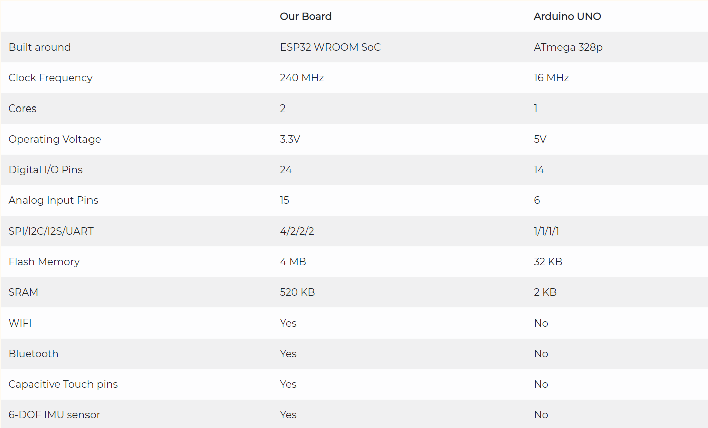

## Electronics Club Custom Development Board
Our Custom Dev Board is developed around the ESP32 WROOM SoC (System-on-Chip) and comes with WiFi and Bluetooth functionalities. The Board comes with an in-built IMU (Inertial Measurement Unit) Sensor and an RGB LED.                        

### Pin Description:
                  
###### Legend: GPIO - General Purpose Input/Output Pin, SPI - Serial Peripheral Interface, I2C - Inter-Integrated Circuit, ADC - Analog-to-Digital Converter, DAC - Digital-to-Analog Converter, Touch - Capacitive Touch Pin
### Custom Dev Board vs Arduino UNO:

