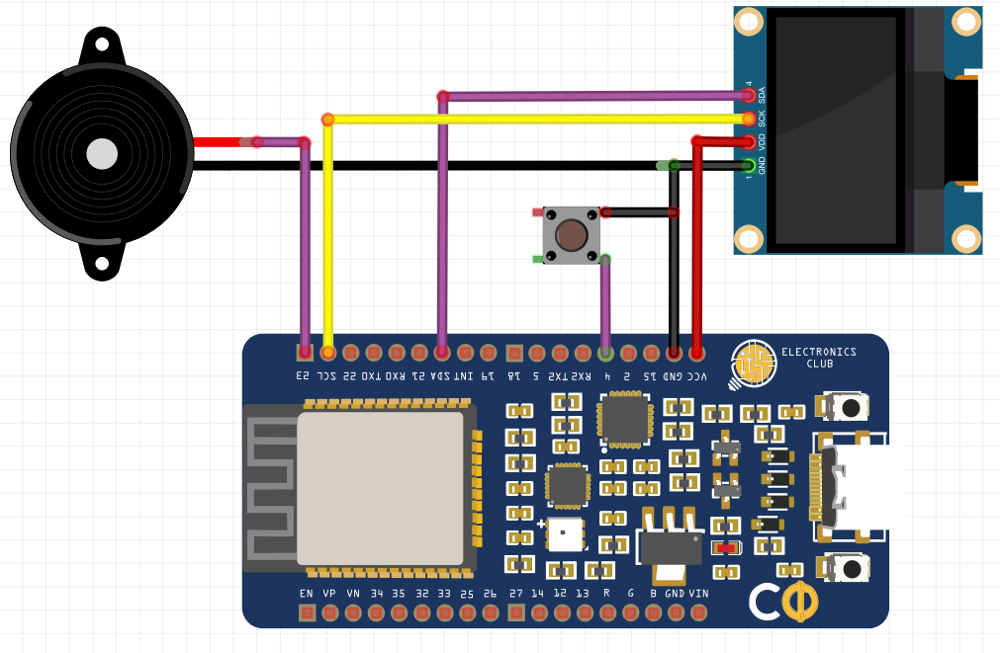

# Flappy Bird Game using ESP32
## Description
The classic Flappy Bird Game on OLED using ESP32
## Prerequisites
* Arduino IDE     
* Download the following [OLED Library](https://github.com/ThingPulse/esp8266-oled-ssd1306) as a *.zip* file and add it to your Arduino IDE. Go through the documentation carefully
## Components
* Electronics Club Custom Dev Board
* OLED Display
* Buzzer
* Pushbutton     
* Jumpers
## Schematic
VCC of OLED --> VCC of CDB      
GND of OLED --> GND of CDB      
SDA of OLED --> 21 of CDB       
SCL of OLED --> 22 of CDB      
Buzzer (longer leg) --> 23 of CDB     
Buzzer (shorter leg) --> GND          
Push Button  --> 4 of CDB              
Push Button --> GND         

## Code
Download the following folder containing the [Code](https://github.com/CFI-Electronics-Club/Dev-Board-Documentation/tree/main/Jayanth/Flappy%20Bird%20Game/Flappy_Bird_Game) and other required files
## References
[ESP32 Flappy Bird Game](https://www.hackster.io/arduinob2016/esp32-flappy-bird-game-54391c)
