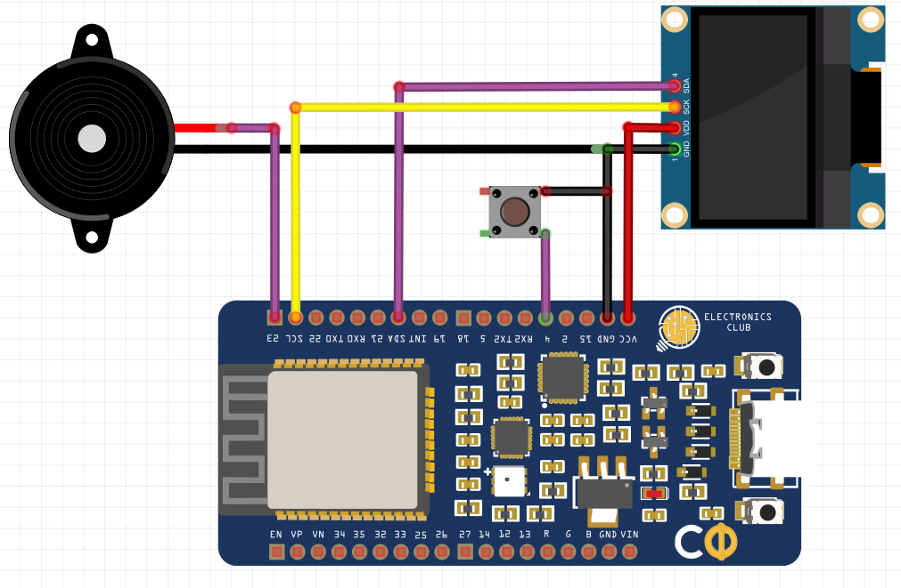

# Flappy Bird Game using ESP32
## Description
The classic Flappy Bird Game on OLED using ESP32
## Prerequisites
* Arduino IDE     
* Download the following [OLED Library](https://github.com/ThingPulse/esp8266-oled-ssd1306) as a *.zip* file and add it to your Arduino IDE. Go through the documentation carefully
## Components
* Electronics Club Custom Dev Board
* OLED Display
* Buzzer
* Pushbutton     
* Jumpers
## Schematic
VCC of OLED --> VCC of CDB      
GND of OLED --> GND of CDB      
SDA of OLED --> 21 of CDB       
SCL of OLED --> 22 of CDB      
Buzzer (longer leg) --> 23 of CDB     
Buzzer (shorter leg) --> GND          
Push Button  --> 4 of CDB              
Push Button --> GND         

## Code
```
#include <Wire.h>  // Only needed for Arduino 1.6.5 and earlier
#include "SSD1306Wire.h" // legacy include: `#include "SSD1306.h"`

#include "images.h"
#include "fontovi.h"

SSD1306Wire  display(0x3c, 21, 22);

#define DEMO_DURATION 3000
typedef void (*Demo)(void);

float zidx[4];
int prazan[4];
int razmak=32;
int sirinaProlaza=30;
void setup() {
   
  Serial.println();
  Serial.println();

pinMode(2,OUTPUT);
pinMode(23,OUTPUT);
pinMode(4,INPUT_PULLUP); 
  display.init();

  for(int i=0;i<4;i++)
  {
    zidx[i]=128+((i+1)*razmak);
    {prazan[i]=random(8,32);}
    }

  display.flipScreenVertically();
  display.setFont(ArialMT_Plain_10);

}


 // display.drawProgressBar(0, 32, 120, 10, progress);

// display.setPixel(i, i);

 //  display.drawXbm(34, 14, WiFi_Logo_width, WiFi_Logo_height, WiFi_Logo_bits);
//display.fillCircle(96, 32, 32 - i* 3);


//display.drawRect(12, 12, 20, 20);
 //display.setFont(ArialMT_Plain_10);
   // display.setColor(WHITE);
   
  //  display.fillRect(14, 14, 17, 17);
int score=0;
int stis=0;
float fx=30.00;
float fy=22.00;
int smjer=0;
unsigned long trenutno=0;

int igra=0;
int frame=0;
int sviraj=0;
unsigned long ton=0;
void loop() {

   display.clear();

   if(igra==0)
   {
    display.setFont(ArialMT_Plain_16);
    display.drawString(0,4,"Flappy ");
   display.drawXbm(0, 0, 128, 64, pozadina);
   display.drawXbm(20, 32, 14, 9, ptica);

   display.setFont(ArialMT_Plain_10);
   display.drawString(0,44,"press to start");
    if(digitalRead(4)==0)
    igra=1;
    }

   if(igra==1)
   {
   display.setFont(ArialMT_Plain_10);
   display.drawString(3,0,String(score));
   
   if(digitalRead(4)==0)
   {
    if(stis==0)
      {
        trenutno=millis();
        smjer=1;
        sviraj=1;
        stis=1;
        ton=millis();
       
        }
    
    }else{stis=0;}

   
    for(int j=0;j<4;j++){
       display.setColor(WHITE);
    display.fillRect(zidx[j],0,6,64);
     display.setColor(BLACK);
      display.fillRect(zidx[j],prazan[j],6,sirinaProlaza);
   
    }

  display.setColor(WHITE);
 //  display.fillCircle(fx, fy, 4); // igrac
  display.drawXbm(fx, fy, 14, 9, ptica);
  
    for(int j=0;j<4;j++)
    {
    zidx[j]=zidx[j]-0.01;
    if(zidx[j]<-7){
      score=score+1;
      
      
       digitalWrite(23,1);
      prazan[j]=random(8,32);
     
    zidx[j]=128;
    }
    }
  if((trenutno+185)<millis())
  smjer=0;

    if((ton+40)<millis())
  sviraj=0;

if(smjer==0)
 fy=fy+0.01;
else
 fy=fy-0.03;


 if(sviraj==1)
 digitalWrite(23,1);
 else
 digitalWrite(23,0);

if(fy>63 || fy<0){
igra=0;
fy=22;
score=0;
 digitalWrite(23,1);
  delay(500);
   digitalWrite(23,0); 
for(int i=0;i<4;i++)
  {
    zidx[i]=128+((i+1)*razmak);
    {prazan[i]=random(4,30);}
    }
}

for(int m=0;m<4;m++)
if(zidx[m]<=fx+7 && fx+7<=zidx[m]+6)
{
  
 
  if(fy<prazan[m] || fy+8>prazan[m]+sirinaProlaza){
  igra=0;
  fy=22;
  score=0;
  digitalWrite(23,1);
  delay(500);
   digitalWrite(23,0);
  for(int i=0;i<4;i++)
  {
    zidx[i]=128+((i+1)*razmak);
    {prazan[i]=random(8,32);}
    }
  }}
   display.drawRect(0,0,128,64);
   }
  
   display.display();

}
```
#### Header Files included in the code
##### images.h:
```
#define WiFi_Logo_width 60
#define WiFi_Logo_height 36

// Filename: Darth-Vader-icon.png
// Filesize: 4830 Bytes

// Size bitmap: 512 bytes

//------------------------------------------------------------------------------
// File generated by LCD Assistant
// http://en.radzio.dxp.pl/bitmap_converter/
//------------------------------------------------------------------------------

const uint8_t pozadina[] PROGMEM = {
  0x00, 0x00, 0x00, 0x00, 0x00, 0x00, 0x00, 0x00, 0x00, 0x00, 0x00, 0x00, 
  0x00, 0x00, 0x00, 0x00, 0x00, 0x00, 0x00, 0x00, 0x00, 0x00, 0x00, 0x00, 
  0x00, 0x00, 0x00, 0x00, 0x00, 0x00, 0x00, 0x00, 0x00, 0x00, 0x00, 0x00, 
  0x00, 0x00, 0x00, 0x00, 0x00, 0x00, 0x00, 0x00, 0x00, 0x00, 0x00, 0x00, 
  0x00, 0x00, 0x00, 0x00, 0x00, 0x00, 0x00, 0x00, 0x00, 0x00, 0x00, 0x00, 
  0x00, 0x00, 0x00, 0x00, 0x00, 0x00, 0x00, 0x00, 0x00, 0x00, 0x00, 0x00, 
  0x00, 0x00, 0x00, 0x00, 0x00, 0x00, 0x00, 0x00, 0x00, 0x00, 0x00, 0x00, 
  0x00, 0x00, 0x00, 0x00, 0x00, 0x00, 0x00, 0x00, 0x00, 0x00, 0x00, 0x00, 
  0x00, 0x00, 0x00, 0x00, 0x00, 0x00, 0x00, 0x00, 0x00, 0x00, 0x00, 0x00, 
  0x00, 0x00, 0x00, 0x00, 0x00, 0x00, 0x00, 0x00, 0x00, 0x00, 0x00, 0x00, 
  0x00, 0x00, 0x00, 0x00, 0xE0, 0xFF, 0xFF, 0x0F, 0x00, 0x00, 0x00, 0x00, 
  0x00, 0x00, 0x00, 0x00, 0x00, 0x00, 0x00, 0x00, 0x10, 0x00, 0x00, 0x0C, 
  0x00, 0x00, 0x00, 0x00, 0x00, 0x00, 0x00, 0x00, 0x00, 0x00, 0x00, 0x00, 
  0x08, 0x00, 0x00, 0x0A, 0x00, 0x00, 0x00, 0x00, 0x00, 0x00, 0x00, 0x00, 
  0x00, 0x00, 0x00, 0x00, 0x04, 0x00, 0x00, 0x09, 0x00, 0x00, 0x00, 0x00, 
  0x00, 0x00, 0x00, 0x00, 0x00, 0x00, 0x00, 0x00, 0xFE, 0xFF, 0xFF, 0x08, 
  0x00, 0x00, 0x00, 0x00, 0x00, 0x00, 0x00, 0x00, 0x00, 0x00, 0x00, 0x00, 
  0x02, 0x00, 0x80, 0x08, 0x00, 0x00, 0x00, 0x00, 0x00, 0x00, 0x00, 0x00, 
  0x00, 0x00, 0x00, 0x00, 0x02, 0x00, 0x80, 0x08, 0x00, 0x00, 0x00, 0x00, 
  0x00, 0x00, 0x00, 0x00, 0x00, 0x00, 0x00, 0x00, 0x02, 0x00, 0x80, 0x08, 
  0x00, 0x00, 0x00, 0x00, 0x00, 0x00, 0x00, 0x00, 0x00, 0x00, 0x00, 0x00, 
  0xF2, 0xCF, 0x9F, 0x08, 0x00, 0x00, 0x00, 0x00, 0x00, 0x00, 0x00, 0x00, 
  0x00, 0x00, 0x00, 0x00, 0x12, 0x48, 0x90, 0x08, 0x00, 0x00, 0x00, 0x00, 
  0x00, 0x00, 0x00, 0x00, 0x00, 0x00, 0x00, 0x00, 0x12, 0x48, 0x90, 0x08, 
  0x00, 0x00, 0x00, 0x00, 0x00, 0x00, 0x00, 0x00, 0x00, 0x00, 0x00, 0x00, 
  0x12, 0x48, 0x90, 0x08, 0x00, 0x00, 0x00, 0x00, 0x00, 0x00, 0x00, 0x00, 
  0x00, 0x00, 0x00, 0x00, 0x12, 0x48, 0x90, 0x08, 0x00, 0x00, 0x00, 0x00, 
  0x00, 0x00, 0x00, 0x00, 0x00, 0x00, 0x00, 0x3E, 0x12, 0x48, 0x90, 0x08, 
  0x00, 0x00, 0x00, 0x00, 0x00, 0x00, 0x00, 0x00, 0x00, 0x00, 0x00, 0x41, 
  0x12, 0x48, 0x90, 0x08, 0x00, 0x00, 0x00, 0x00, 0x00, 0x00, 0x00, 0x00, 
  0x00, 0xF8, 0xFF, 0x84, 0x13, 0x48, 0x90, 0x08, 0x00, 0x00, 0x00, 0x00, 
  0x00, 0x00, 0x00, 0x00, 0x00, 0x04, 0x00, 0xC3, 0xF2, 0xCF, 0x9F, 0x08, 
  0x00, 0x00, 0x00, 0x00, 0x00, 0x00, 0x00, 0x00, 0x00, 0x02, 0x00, 0xBF, 
  0x02, 0x00, 0x80, 0x08, 0x00, 0x00, 0x00, 0x00, 0x00, 0x00, 0x00, 0x00, 
  0x00, 0x01, 0x80, 0x80, 0x02, 0x00, 0x80, 0x08, 0x00, 0x00, 0x00, 0x00, 
  0x00, 0x00, 0x00, 0x00, 0x00, 0xFF, 0xFF, 0x7F, 0x02, 0x00, 0x80, 0x08, 
  0x00, 0x00, 0x00, 0x00, 0x00, 0x00, 0x00, 0x00, 0x00, 0x01, 0x00, 0x20, 
  0xF2, 0x0F, 0x80, 0x08, 0x00, 0x00, 0x00, 0x00, 0x00, 0x00, 0x00, 0x00, 
  0x00, 0x01, 0x00, 0x20, 0x12, 0x08, 0x80, 0x08, 0x00, 0x00, 0x00, 0x00, 
  0x00, 0x00, 0x00, 0x00, 0x00, 0x01, 0x00, 0x20, 0x12, 0x08, 0x80, 0x08, 
  0x00, 0x00, 0x00, 0x00, 0x00, 0x00, 0x00, 0x00, 0x00, 0xF9, 0xF3, 0x27, 
  0x12, 0x08, 0x80, 0x08, 0x00, 0x00, 0x00, 0x00, 0x00, 0x00, 0x00, 0x00, 
  0x00, 0x09, 0x12, 0x24, 0x12, 0x08, 0x80, 0x08, 0x00, 0x00, 0x00, 0x00, 
  0x00, 0x00, 0x00, 0x00, 0x00, 0x09, 0x12, 0x24, 0x12, 0x08, 0x80, 0x08, 
  0x00, 0x00, 0x00, 0x00, 0x00, 0x00, 0x00, 0x00, 0x00, 0x09, 0x12, 0x24, 
  0x12, 0x08, 0x80, 0x08, 0x00, 0x00, 0x00, 0x00, 0x00, 0x00, 0x00, 0x00, 
  0x00, 0x09, 0x12, 0x24, 0x12, 0x08, 0x80, 0x08, 0x00, 0x00, 0x00, 0x00, 
  0x00, 0x00, 0x00, 0x00, 0x00, 0x09, 0x12, 0x24, 0xF2, 0x0F, 0x80, 0x08, 
  0x00, 0x00, 0x00, 0x00, 0x00, 0x00, 0x00, 0x00, 0x00, 0x09, 0x12, 0x24, 
  0x02, 0x00, 0x80, 0x08, 0x00, 0x00, 0x00, 0x00, 0x00, 0x00, 0x00, 0x00, 
  0x00, 0x09, 0x12, 0x24, 0x02, 0x00, 0x80, 0x08, 0x00, 0x00, 0x00, 0x00, 
  0x00, 0x00, 0x00, 0x00, 0x00, 0xF9, 0xF3, 0x27, 0x02, 0x00, 0x80, 0x08, 
  0x00, 0x00, 0x00, 0x00, 0x00, 0x00, 0x00, 0x00, 0x00, 0x01, 0x00, 0x20, 
  0x02, 0x00, 0x80, 0x08, 0x00, 0x00, 0x00, 0x00, 0x00, 0x00, 0x00, 0x00, 
  0x00, 0x01, 0x00, 0x20, 0x02, 0x00, 0x80, 0x08, 0x00, 0x00, 0x00, 0x00, 
  0x00, 0x00, 0x00, 0x00, 0x00, 0x01, 0x00, 0x20, 0xF2, 0xE2, 0x95, 0x08, 
  0x00, 0x00, 0x00, 0x00, 0x00, 0x00, 0x00, 0x00, 0x00, 0x01, 0x00, 0x20, 
  0x92, 0x22, 0x95, 0x08, 0x00, 0x00, 0x00, 0x00, 0x00, 0x00, 0x00, 0x00, 
  0x00, 0x01, 0x00, 0x20, 0xF2, 0x22, 0x9D, 0x08, 0x00, 0x00, 0x00, 0x00, 
  0x00, 0x00, 0x00, 0x00, 0x00, 0x01, 0xE0, 0x27, 0x12, 0xE2, 0x91, 0x08, 
  0x00, 0x00, 0x00, 0x00, 0x00, 0x00, 0x00, 0x00, 0x00, 0x01, 0x20, 0x24, 
  0x12, 0x2E, 0x91, 0x08, 0x00, 0x00, 0x00, 0x00, 0x00, 0x00, 0x00, 0x00, 
  0x00, 0x01, 0x20, 0x24, 0x02, 0x00, 0x80, 0x08, 0x00, 0x00, 0x00, 0x00, 
  0x00, 0x00, 0x00, 0x00, 0x00, 0x01, 0x20, 0x24, 0x02, 0x00, 0x80, 0x08, 
  0x00, 0x00, 0x00, 0x00, 0x00, 0x00, 0x00, 0x00, 0x00, 0x01, 0x20, 0x24, 
  0xE2, 0xFF, 0x9F, 0x08, 0x00, 0x00, 0x00, 0x00, 0x00, 0x00, 0x00, 0x00, 
  0x00, 0x01, 0x20, 0x24, 0x22, 0x10, 0x90, 0x08, 0x00, 0x00, 0x00, 0x00, 
  0x00, 0x00, 0x00, 0x00, 0x00, 0x01, 0x20, 0x24, 0x22, 0x10, 0x90, 0x08, 
  0x00, 0x00, 0x00, 0x00, 0x00, 0x00, 0x00, 0x00, 0x00, 0x01, 0x20, 0x24, 
  0x22, 0x10, 0x90, 0x08, 0x00, 0x00, 0x00, 0x00, 0x00, 0x00, 0x00, 0x00, 
  0x00, 0x01, 0x20, 0x25, 0x22, 0x10, 0x90, 0x08, 0x00, 0x00, 0x00, 0x00, 
  0x00, 0x00, 0x00, 0x00, 0x00, 0x01, 0x20, 0x24, 0x22, 0xD6, 0x90, 0x08, 
  0x00, 0x00, 0x00, 0x00, 0x00, 0x00, 0x00, 0x00, 0x00, 0x01, 0x20, 0x24, 
  0x22, 0xD6, 0x90, 0x08, 0x00, 0x00, 0x00, 0x00, 0x00, 0x00, 0x00, 0x00, 
  0x00, 0x01, 0x20, 0x24, 0x22, 0x10, 0x90, 0x08, 0x00, 0x00, 0x00, 0x00, 
  0x00, 0x00, 0x00, 0x00, 0x00, 0x01, 0x20, 0x24, 0x22, 0x10, 0x90, 0x08, 
  0x00, 0x00, 0x00, 0x00, 0x00, 0x00, 0x00, 0x00, 0x00, 0x01, 0xE0, 0x27, 
  0x22, 0x10, 0x90, 0x08, 0x00, 0x00, 0x00, 0x00, 0x00, 0x00, 0x00, 0x00, 
  0x00, 0x01, 0xE0, 0x27, 0x22, 0x10, 0x90, 0x08, 0x00, 0x00, 0x00, 0x00, 
  0x00, 0x00, 0x00, 0x00, 0x00, 0xFF, 0xFF, 0x3F, 0xFE, 0xFF, 0xFF, 0x08, 
  0xFF, 0xFF, 0xFF, 0xFF, 0xFF, 0xFF, 0xFF, 0xFF, 0xFF, 0xFF, 0xFF, 0xFF, 
  0xFF, 0xFF, 0xFF, 0xFF, 0xFF, 0xFF, 0xFF, 0xFF, 0xFF, 0xFF, 0xFF, 0xFF, 
  0xFF, 0xFF, 0xFF, 0xFF, 0xFF, 0xFF, 0xFF, 0xFF, 0xFF, 0xFF, 0xFF, 0xFF, 
  0xFF, 0xFF, 0xFF, 0xFF, 0xFF, 0xFF, 0xFF, 0xFF, 0xFF, 0xFF, 0xFF, 0xFF, 
  0xFF, 0xFF, 0xFF, 0xFF, 0xFF, 0xFF, 0xFF, 0xFF, 0xFF, 0xFF, 0xFF, 0xFF, 
  0xFF, 0xFF, 0xFF, 0xFF, };


const uint8_t ptica[] PROGMEM = {
  0xE0, 0x07, 0xAE, 0x08, 0x91, 0x0A, 0x91, 0x08, 0x21, 0x0F, 0x3E, 0x3C, 
  0x04, 0x3C, 0x08, 0x02, 0xF0, 0x01, };


const uint8_t bits[] PROGMEM = {
  0x00, 0x00, 0x00, 0x00, 0x00, 0x00, 0x00, 0x00, 0x00, 0x00, 0xC0, 0xFF, 
  0xFF, 0x03, 0x00, 0x00, 0x00, 0x00, 0xF0, 0xFF, 0xFF, 0x0F, 0x00, 0x00, 
  0x00, 0x00, 0xFC, 0xFF, 0xFF, 0x3F, 0x00, 0x00, 0x00, 0x00, 0xFE, 0xFF, 
  0xFF, 0x7F, 0x00, 0x00, 0x00, 0x80, 0xFF, 0xFF, 0xFF, 0xFF, 0x01, 0x00, 
  0x00, 0xC0, 0xFF, 0xFF, 0xFF, 0xFF, 0x03, 0x00, 0x00, 0xC0, 0xFF, 0xFF, 
  0xFF, 0xFF, 0x03, 0x00, 0x00, 0xE0, 0xFF, 0xFF, 0xFF, 0xFF, 0x07, 0x00, 
  0x00, 0xF0, 0xFF, 0xFF, 0xFF, 0xFF, 0x0F, 0x00, 0x00, 0xF0, 0xFF, 0xFF, 
  0xFF, 0xFF, 0x0F, 0x00, 0x00, 0xF8, 0xFF, 0xFF, 0xFF, 0xFF, 0x1F, 0x00, 
  0x00, 0xF8, 0xFF, 0xFF, 0xFF, 0xFF, 0x1F, 0x00, 0x00, 0xFC, 0xFF, 0xFF, 
  0xFF, 0xFF, 0x3F, 0x00, 0x00, 0xFC, 0xFF, 0xFF, 0xFF, 0xFF, 0x3F, 0x00, 
  0x00, 0xFC, 0xFF, 0xFF, 0xFF, 0xFF, 0x3F, 0x00, 0x00, 0xFC, 0xFF, 0xFF, 
  0xFF, 0xFF, 0x3F, 0x00, 0x00, 0xFC, 0xFF, 0xFF, 0xFF, 0xFF, 0x3F, 0x00, 
  0x00, 0xFC, 0xFF, 0xFF, 0xFF, 0xFF, 0x3F, 0x00, 0x00, 0xFC, 0xFF, 0xFF, 
  0xFF, 0xFF, 0x3F, 0x00, 0x00, 0xFC, 0x07, 0xF0, 0x0F, 0xE0, 0x3F, 0x00, 
  0x00, 0xFC, 0x01, 0xC0, 0x03, 0x80, 0x3F, 0x00, 0x00, 0xFC, 0xF0, 0x07, 
  0xE0, 0x0F, 0x3F, 0x00, 0x00, 0x7C, 0xFC, 0x1F, 0xF8, 0x3F, 0x3E, 0x00, 
  0x00, 0x3C, 0xFE, 0x7F, 0xFE, 0x7F, 0x3C, 0x00, 0x00, 0x3C, 0x3F, 0xFC, 
  0x3F, 0xFC, 0x3C, 0x00, 0x00, 0x1C, 0x0F, 0xF0, 0x0F, 0xF0, 0x38, 0x00, 
  0x00, 0x9E, 0x03, 0xE0, 0x07, 0xC0, 0x79, 0x00, 0x00, 0x8E, 0x01, 0xC0, 
  0x03, 0x80, 0x71, 0x00, 0x00, 0xCE, 0x01, 0xC0, 0x03, 0x80, 0x73, 0x00, 
  0x00, 0xCF, 0x01, 0xC0, 0x03, 0x80, 0xF3, 0x00, 0x00, 0xC7, 0x00, 0xC0, 
  0x03, 0x00, 0xE3, 0x00, 0x80, 0xE7, 0x00, 0xC0, 0x03, 0x00, 0xE7, 0x01, 
  0x80, 0xE3, 0x01, 0xC0, 0x03, 0x80, 0xC7, 0x01, 0x80, 0xF3, 0xFF, 0xFF, 
  0xFF, 0xFF, 0xCF, 0x01, 0xC0, 0xF3, 0xFF, 0xFF, 0xFF, 0xFF, 0xCF, 0x03, 
  0xC0, 0xF1, 0xFF, 0x7F, 0xFE, 0xFF, 0x8F, 0x03, 0xC0, 0xF9, 0xFF, 0x3F, 
  0xFC, 0xFF, 0x9F, 0x03, 0xE0, 0xF8, 0xFF, 0x1F, 0xF8, 0xFF, 0x1F, 0x07, 
  0xE0, 0xFC, 0xFF, 0x1F, 0xF8, 0xFF, 0x3F, 0x07, 0xF0, 0xFC, 0xFF, 0x1F, 
  0xF8, 0xFF, 0x3F, 0x0F, 0x70, 0xFC, 0xFF, 0x1F, 0xF8, 0xFF, 0x3F, 0x0E, 
  0x70, 0xFE, 0xFF, 0x1F, 0xF8, 0xFF, 0x7F, 0x0E, 0x38, 0xFE, 0xFF, 0xFF, 
  0xFF, 0xFF, 0x7F, 0x1C, 0x38, 0xFF, 0xFF, 0xFF, 0xFF, 0xFF, 0xFF, 0x1C, 
  0x3C, 0xFF, 0xFF, 0x8F, 0xF1, 0xFF, 0xFF, 0x3C, 0x1C, 0xFF, 0xFF, 0x8F, 
  0xF1, 0xFF, 0xFF, 0x38, 0x9C, 0xFF, 0xFF, 0x8F, 0xF1, 0xFF, 0xFF, 0x39, 
  0x9E, 0xFF, 0xFF, 0x8E, 0x71, 0xFF, 0xFF, 0x79, 0x8E, 0xFF, 0x7F, 0x8E, 
  0x71, 0xFE, 0xFF, 0x71, 0xCE, 0xFF, 0x7F, 0x8E, 0x71, 0xFE, 0xFF, 0x73, 
  0xFE, 0xFF, 0x7F, 0x8E, 0x71, 0xFE, 0xFF, 0x7F, 0xFC, 0xFF, 0x7F, 0x8E, 
  0x71, 0xFE, 0xFF, 0x3F, 0xF8, 0xFF, 0x71, 0x8E, 0x71, 0x8E, 0xFF, 0x1F, 
  0xF0, 0xFF, 0xF1, 0xFF, 0xFF, 0x8F, 0xFF, 0x0F, 0xE0, 0xFF, 0xF1, 0xFF, 
  0xFF, 0x8F, 0xFF, 0x07, 0x80, 0xFF, 0xFF, 0xFF, 0xFF, 0xFF, 0xFF, 0x01, 
  0x00, 0xFE, 0xFF, 0xFF, 0xFF, 0xFF, 0x7F, 0x00, 0x00, 0xFC, 0xFF, 0xFF, 
  0xFF, 0xFF, 0x3F, 0x00, 0x00, 0xE0, 0xFF, 0xFF, 0xFF, 0xFF, 0x07, 0x00, 
  0x00, 0x80, 0xFF, 0xFF, 0xFF, 0xFF, 0x01, 0x00, 0x00, 0x00, 0xF8, 0xFF, 
  0xFF, 0x1F, 0x00, 0x00, 0x00, 0x00, 0x80, 0xFF, 0xFF, 0x01, 0x00, 0x00, 
  0x00, 0x00, 0x00, 0x00, 0x00, 0x00, 0x00, 0x00, };


const uint8_t WiFi_Logo_bits[] PROGMEM = {
  0x00, 0x00, 0x00, 0x00, 0x00, 0x00, 0x00, 0x00, 0x00, 0x00, 0x00, 0xF8,
  0x00, 0x00, 0x00, 0x00, 0x00, 0x00, 0x80, 0xFF, 0x07, 0x00, 0x00, 0x00,
  0x00, 0x00, 0xE0, 0xFF, 0x1F, 0x00, 0x00, 0x00, 0x00, 0x00, 0xF8, 0xFF,
  0x7F, 0x00, 0x00, 0x00, 0x00, 0x00, 0xFC, 0xFF, 0xFF, 0x00, 0x00, 0x00,
  0x00, 0x00, 0xFE, 0xFF, 0xFF, 0x01, 0x00, 0x00, 0x00, 0x00, 0xFF, 0xFF,
  0xFF, 0x03, 0x00, 0x00, 0x00, 0xFC, 0xFF, 0xFF, 0xFF, 0xFF, 0x00, 0x00,
  0x00, 0xFF, 0xFF, 0xFF, 0x07, 0xC0, 0x83, 0x01, 0x80, 0xFF, 0xFF, 0xFF,
  0x01, 0x00, 0x07, 0x00, 0xC0, 0xFF, 0xFF, 0xFF, 0x00, 0x00, 0x0C, 0x00,
  0xC0, 0xFF, 0xFF, 0x7C, 0x00, 0x60, 0x0C, 0x00, 0xC0, 0x31, 0x46, 0x7C,
  0xFC, 0x77, 0x08, 0x00, 0xE0, 0x23, 0xC6, 0x3C, 0xFC, 0x67, 0x18, 0x00,
  0xE0, 0x23, 0xE4, 0x3F, 0x1C, 0x00, 0x18, 0x00, 0xE0, 0x23, 0x60, 0x3C,
  0x1C, 0x70, 0x18, 0x00, 0xE0, 0x03, 0x60, 0x3C, 0x1C, 0x70, 0x18, 0x00,
  0xE0, 0x07, 0x60, 0x3C, 0xFC, 0x73, 0x18, 0x00, 0xE0, 0x87, 0x70, 0x3C,
  0xFC, 0x73, 0x18, 0x00, 0xE0, 0x87, 0x70, 0x3C, 0x1C, 0x70, 0x18, 0x00,
  0xE0, 0x87, 0x70, 0x3C, 0x1C, 0x70, 0x18, 0x00, 0xE0, 0x8F, 0x71, 0x3C,
  0x1C, 0x70, 0x18, 0x00, 0xC0, 0xFF, 0xFF, 0x3F, 0x00, 0x00, 0x08, 0x00,
  0xC0, 0xFF, 0xFF, 0x1F, 0x00, 0x00, 0x0C, 0x00, 0x80, 0xFF, 0xFF, 0x1F,
  0x00, 0x00, 0x06, 0x00, 0x80, 0xFF, 0xFF, 0x0F, 0x00, 0x00, 0x07, 0x00,
  0x00, 0xFE, 0xFF, 0xFF, 0xFF, 0xFF, 0x01, 0x00, 0x00, 0xF8, 0xFF, 0xFF,
  0xFF, 0x7F, 0x00, 0x00, 0x00, 0x00, 0xFE, 0xFF, 0xFF, 0x01, 0x00, 0x00,
  0x00, 0x00, 0xFC, 0xFF, 0xFF, 0x00, 0x00, 0x00, 0x00, 0x00, 0xF8, 0xFF,
  0x7F, 0x00, 0x00, 0x00, 0x00, 0x00, 0xE0, 0xFF, 0x1F, 0x00, 0x00, 0x00,
  0x00, 0x00, 0x80, 0xFF, 0x07, 0x00, 0x00, 0x00, 0x00, 0x00, 0x00, 0xFC,
  0x00, 0x00, 0x00, 0x00, 0x00, 0x00, 0x00, 0x00, 0x00, 0x00, 0x00, 0x00,
  };
  ```
## References
[ESP32 Flappy Bird Game](https://www.hackster.io/arduinob2016/esp32-flappy-bird-game-54391c)

