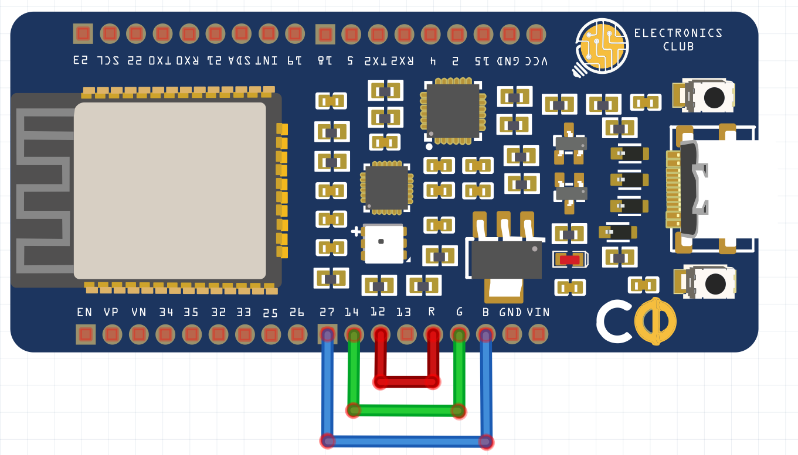

# Controlling GPIOs using Telegram
## Description
This project demonstrates how to control outputs of GPIOs using Telegram. As an example, we will control the internal RGB LED in the Custom Development Board using Telegram messages
## Prerequisites
* Telegram App on your Device           
* Arduino IDE
* Download the [Universal Telegram Bot Library](https://github.com/witnessmenow/Universal-Arduino-Telegram-Bot/archive/master.zip) and add this into your Arduino IDE         
###### Note: Don’t install the library through the Arduino Library Manager because it might install a deprecated version             
* Install the **ArduinoJson** library from the Library Manager in Arduino IDE
## Components
* Electronics Club Custom Development Board CDB
## Schematic
R of CDB --> Any GPIO (12 in Code)                   
G of CDB --> Any GPIO (14 in Code)              
B of CDB --> Any GPIO (27 in Code)            

