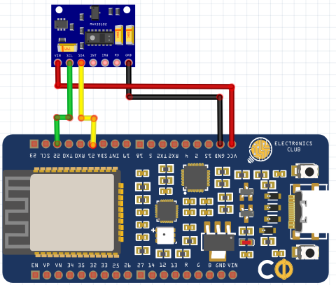

# IoT Based Heart Rate Monitor using MAX30100 Pulse Oximeter and ESP32

Pulse oximetry is a widely used medical measurement instrument and it is a non-invasive and painless test that measures oxygen saturation level in our blood that can easily detect small changes in oxygen. In the current Covid-19 situation, it has become important to track the oxygen level of multiple patients at the same time remotely without getting into contact with the patient.

## Description
So, in this project, we build a pulse oximeter using MAX30100 Pulse oximeter and ESP32 that will track the Blood Oxygen level and send the data via internet by connecting to a Wi-Fi network. This way, we can monitor multiple patients remotely by maintaining social distance with the patients. The obtained data will be shown as a graph which makes it easier for tracking and analyzing the patient’s condition. Previously, we have also built other heart rate monitors using pulse sensors. And if you are interested in other Covid-19 related projects, you can check out the Human body thermometer, Smart IR Thermometer for fever monitoring, and Wall-Mount Temperature scanner that we build earlier.

## Pulse Oximeter sensor : MAX30100 Sensor
MAX30100 sensor is integrated pulse oximetry and heart rate monitor module. It communicates with the I2C data line and provides the SpO2 and Pulse information to the host microcontroller unit. It uses photodetectors, optical elements where red, green IR LED modulates the LED pulses. The LED current is configurable from 0 to 50mA. The below image is showing the MAX30100 sensor.The above sensor module works with 1.8V to the 5.5V range. The pull-up resistors for the I2C pins are included in the module.

## Materials Required
1. ESP32
2. A WiFi connection
3. MAX30100 Sensor
4. Adafruit IO user id and a custom created dashboard (Will make it further)
5. 5V adequate power supply unit with the rated current of at least 1A
6. USB cable Micro USB to USBA

## Circuit Diagram


## Adafruit IO with ESP32
1. First sign up in the adafruit IO after giving the Fist name, last name, email address, user name, and the password.
2. The blank dashboard window will open after the sign-in process is done. In this segment, we will need to create a dashboard to show the data in various ways. Thus, it is time to create the new dashboard and provide the name of the dashboard and the description.
3. After filling the above form, it is time to create the graph and control section for the sensor.
4. Write down the block name. As we can see in the above image, the toggle function will provide two states, ON and OFF. In the same process, select the graph block.
5. The next and final step is to have the adafruit key. As we can see, we get the adafruit key and this needs to be added in the code.

The Adafruit IO is now configured. It is time to prepare the hardware and create the firmware for this project.

## Code
```
#include <stdint.h>
#include <Wire.h>
#include <WiFi.h>
#include "Adafruit_MQTT.h"
#include "Adafruit_MQTT_Client.h"
#include "MAX30100_PulseOximeter.h"  //used arduino builtin MAX30100 lib (https://github.com/oxullo/Arduino-MAX30100)
#define WLAN_SSID          "xxxxxxxxx"
#define WLAN_PASS        "2581xxxxx2"
#define AIO_UPDATE_RATE_SEC 5
#define AIO_SERVER        "io.adafruit.com"
#define AIO_SERVERPORT  1883                 
#define AIO_USERNAME "xxxxxx"
#define AIO_KEY                "abcdefgh"
#define I2C_SDA   21
#define I2C_SCL   22
TaskHandle_t poxReadTaskHld = NULL;
TaskHandle_t mqttPubTaskHld = NULL;
// PulseOximeter is the higher-level interface to the sensor
PulseOximeter pox;
uint32_t tsLastReport = 0;
float bpm_dt=0;
float spo2_dt = 0;
WiFiClient client;
Adafruit_MQTT_Client mqtt(&client, AIO_SERVER, AIO_SERVERPORT, AIO_USERNAME, AIO_KEY);        
Adafruit_MQTT_Subscribe sw_sub = Adafruit_MQTT_Subscribe(&mqtt, AIO_USERNAME "/feeds/switch");
// Notice MQTT paths for AIO follow the form: <username>/feeds/<feedname>
Adafruit_MQTT_Publish bpm_pub = Adafruit_MQTT_Publish(&mqtt, AIO_USERNAME "/feeds/bpm");
Adafruit_MQTT_Publish spo2_pub = Adafruit_MQTT_Publish(&mqtt, AIO_USERNAME "/feeds/SpO2");
// Callback (registered below) fired when a pulse is detected
void onBeatDetected()
{
                Serial.println("Beat!")
}
/******************************************* Function for pause MAX30100 Read **************************************************/
void stopReadPOX(){
  pox.shutdown();
}
/******************************************* Function for Start MAX30100 Read **************************************************/
void startReadPOX(){
  pox.resume();
}
/******************************************* MAX30100 Read task **************************************************/
void poxReadTask( void * param )
{
  while(1){
                // Make sure to call update as fast as possible
                pox.update();
                vTaskDelay( 1 / portTICK_PERIOD_MS );
  }
  poxReadTaskHld = NULL;
  vTaskDelete(NULL); // kill itself
}
/******************************************* MQTT publish task **************************************************/
void mqttPubTask( void * param )
{
  uint8_t sec_count=0;
  while(1){
                Serial.print("Heart rate:");
                float bpm_dt = pox.getHeartRate();
                Serial.print(bpm_dt);
                Serial.print("bpm / SpO2:");
                float spo2_dt = pox.getSpO2();
                Serial.print(spo2_dt);
                Serial.println("%");
                if(sec_count >= AIO_UPDATE_RATE_SEC){
                if (! bpm_pub.publish(bpm_dt)) {
                Serial.println(F("Failed to publish bmp.."));
                } else {
                Serial.println(F("bmp publish OK!"));
                }
                if (! spo2_pub.publish(spo2_dt)) {
                Serial.println(F("Failed to publish SpO2.."));
                } else {
                Serial.println(F("SpO2 publish OK!"));
                }
                sec_count=0;
                }
                vTaskDelay( 1000 / portTICK_PERIOD_MS );
                sec_count++;
  }
  mqttPubTaskHld = NULL;
  vTaskDelete(NULL); // kill itself
}
/******************************************** MQTT Connect Function *******************************************************/
// Function to connect and reconnect as necessary to the MQTT server.
void MQTT_connect() {
  int8_t ret;
  if (mqtt.connected()) {
                return;
  }
  Serial.print("Connecting to MQTT... ");
  uint8_t retries = 3;
  while ((ret = mqtt.connect()) != 0) {
                Serial.println(mqtt.connectErrorString(ret));
                Serial.println("Retrying MQTT connection in 5 seconds...");
                mqtt.disconnect();
                delay(5000);
                retries--;
                if (retries == 0) {
                while (1);
                }
  }
  Serial.println("MQTT Connected!");
}
/**************************************************************************************************/
void setup()
{
                Serial.begin(115200);
                Wire.begin(I2C_SDA, I2C_SCL);
                WiFi.begin(WLAN_SSID, WLAN_PASS);
                while (WiFi.status() != WL_CONNECTED) {
                delay(500);
                Serial.print(".");
                }
                Serial.println();
                Serial.println("WiFi connected");
                Serial.println("IP address: "); Serial.println(WiFi.localIP());
                mqtt.subscribe(&sw_sub);
                Serial.print("Initializing pulse oximeter..");
                // Initialize the PulseOximeter instance
                // Failures are generally due to an improper I2C wiring, missing power supply
                // or wrong target chip
                if (!pox.begin()) {
                Serial.println("FAILED");
                for(;;);
                } else {
                Serial.println("SUCCESS");
                }
                // The default current for the IR LED is 50mA and it could be changed
                //   by uncommenting the following line. Check MAX30100_Registers.h for all the
                //   available options.
                pox.setIRLedCurrent(MAX30100_LED_CURR_7_6MA);
                // Register a callback for the beat detection
                pox.setOnBeatDetectedCallback(onBeatDetected);
                stopReadPOX();
}
void loop() {
  MQTT_connect();
  Adafruit_MQTT_Subscribe *subscription;
  while ((subscription = mqtt.readSubscription(5000)))
  {
                if (subscription == &sw_sub)
                {
                Serial.print(F("Got: "));
                Serial.println((char *)sw_sub.lastread);
                if (!strcmp((char*) sw_sub.lastread, "ON"))
                {
                Serial.print(("Starting POX... "));
                startReadPOX();
                BaseType_t xReturned;
                if(poxReadTaskHld == NULL){
                xReturned = xTaskCreate(
                                poxReadTask,      /* Function that implements the task. */
                                "pox_read",           /* Text name for the task. */
                                1024*3,                  /* Stack size in words, not bytes. */
                                NULL,    /* Parameter passed into the task. */
                                2,/* Priority at which the task is created. */
                                &poxReadTaskHld );          /* Used to pass out the created task's handle. */
                }
                delay(100);
                if(mqttPubTaskHld == NULL){
                xReturned = xTaskCreate(
                                mqttPubTask,       /* Function that implements the task. */
                                "mqttPub",             /* Text name for the task. */
                                1024*3,                  /* Stack size in words, not bytes. */
                                NULL,    /* Parameter passed into the task. */
                                2,/* Priority at which the task is created. */
                                &mqttPubTaskHld );            /* Used to pass out the created task's handle. */
                }
                }
                else
                {
                Serial.print(("Stoping POX... "));
                // Detele POX read task
                if(poxReadTaskHld != NULL){
                vTaskDelete(poxReadTaskHld);
                poxReadTaskHld = NULL;
                }
                // Delete the MQTT Pub Task
                if(mqttPubTaskHld != NULL){
                vTaskDelete(mqttPubTaskHld);
                mqttPubTaskHld = NULL;
                }
                stopReadPOX();
                }
                }
  }
}
```

## References
You can find more details of the project and the description of the components [here](https://circuitdigest.com/microcontroller-projects/ble-based-proximity-control-using-esp32)
